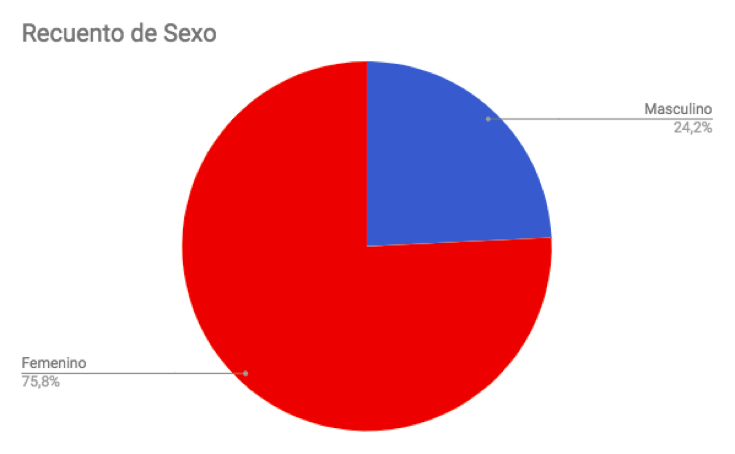
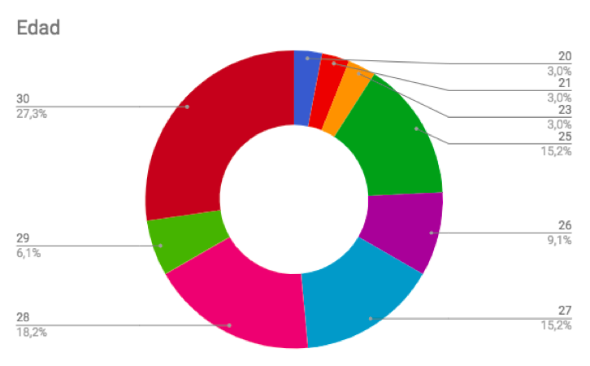
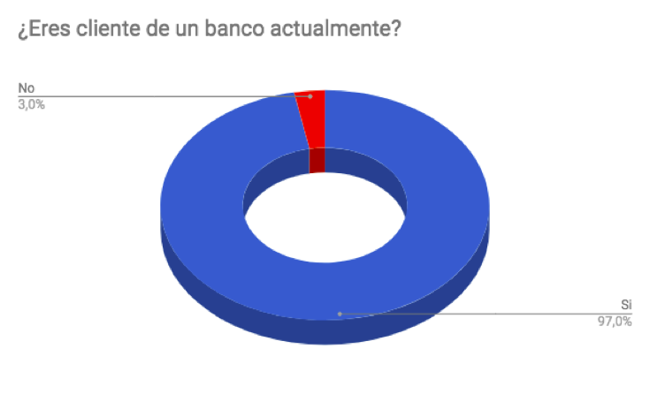
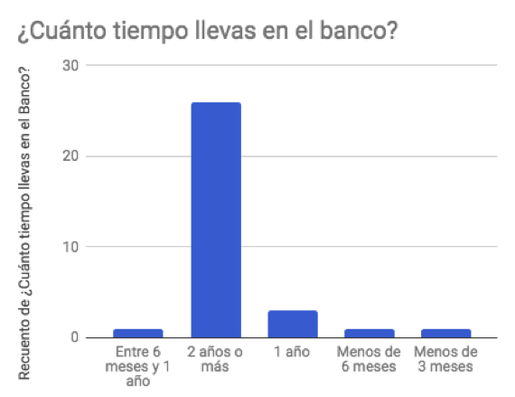

"Easy Bank es una app móvil perteneciente al Banco del País, que permite a sus usuarios “Millennials” crear una cuenta bancaria 100% digital, sin plástico, ni cobros de mantención ni papeleos para acceder a ella."

#Proceso de research

De acuerdo al reto planteado, la primera etapa de investigación fue realizar entrevistas y encuestas a potenciales usuarios, que estuvieran dentro del target asignado.
 
Dentro de un universo de 33 personas encuestadas, entre hombres y mujeres de 18 a 30 años, las principales conclusiones son las siguientes: 

Se organizó en un mapa de afinidad las inquietudes en común de los usuarios de bancos, cuyas frustraciones principales son cobros por mantención, por transferencia y por giros, trámites engorrosos y requisitos que no podían cumplir para abrir una cuenta, y plataformas digitales complicadas e ineficientes.

El pequeño porcentaje que no pertenece a un banco, comparte algunas de las quejas que las personas que sí son clientes, pero estos últimos terminan aceptando las “injusticias” que ejercen los bancos por la necesidad de tener los servicios que ofrecen.
 
Nicolás, de 28 años, manifiesta su descontento con estas palabras:
“No me gusta tener tarjeta, es un mal necesario (…) siempre se me pierden las tarjetas, y es una lata sacarlas de nuevo, además cobran por eso, y cobran mantención. Eso no debería ser. Además es engorroso, porque hay que ir al banco a pedirla, después de nuevo para ir a buscarla. Una vez no fui a buscar una tarjeta, y era como la quinta que se me perdía, por eso dejé de ocupar tarjeta. No me gusta hacer filas tampoco, siempre tenía que hacerlas porque no era cliente preferencial. (…) No me gusta la muchedumbre, ni la gente ni hacer fila. (…) Además con la “Cuenta Rut”, que es lo más accesible, te cobran mucho: por sacar, por hacer transferencia, por todo. Intentan sacarte plata por todos lados y eso no está bien. Por eso no tengo tarjeta ni por eso estoy en un banco. Solo lo ocupo como un medio de depósito y nada más.”

Muchos de los encuestados debían pagar por cada vez que transferían a un tercero. Además la plataforma para transferir no era confiable, según sus propias palabras esta sección se pegaba, se caía o no era clara. Es una queja generalizada y por ello lo representamos en un Customer Journey Map:

Pero la principal “mala experiencia” ocurría a la hora de solicitar una cuenta: los estrictos requisitos y la gran cantidad de documentación que se pide hacían que muchas personas se frustraran al no calzar con los estándares que pedía el banco, ya sea porque no cumplían con lo que se pedía o por falta de documentación y excesivo papeleo:

#MVP

De acuerdo a todas estas inquietudes, nuestro Producto Mínimo Viable debe:

-  Permitir el acceso a cuenta a todos, mayores de 18 años, sin requisitos excluyentes, ni documentos, ni trámites, ya que eso es lo que aleja a la gente y a gran parte los deja fuera por no cumplir con lo que se les pide.
-  Permitir a los clientes realizar transferencias y giros sin cobros de por medio
-  Libre de tarjetas. Nuestro producto es 100% digital
-  Una plataforma amigable, con información clara, que se dirija en un lenguaje sencillo y cercano.

